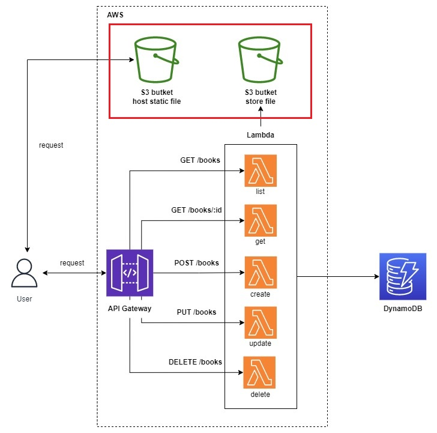
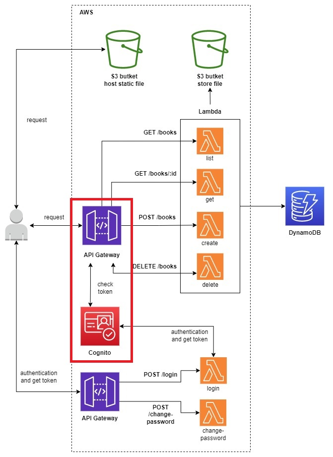
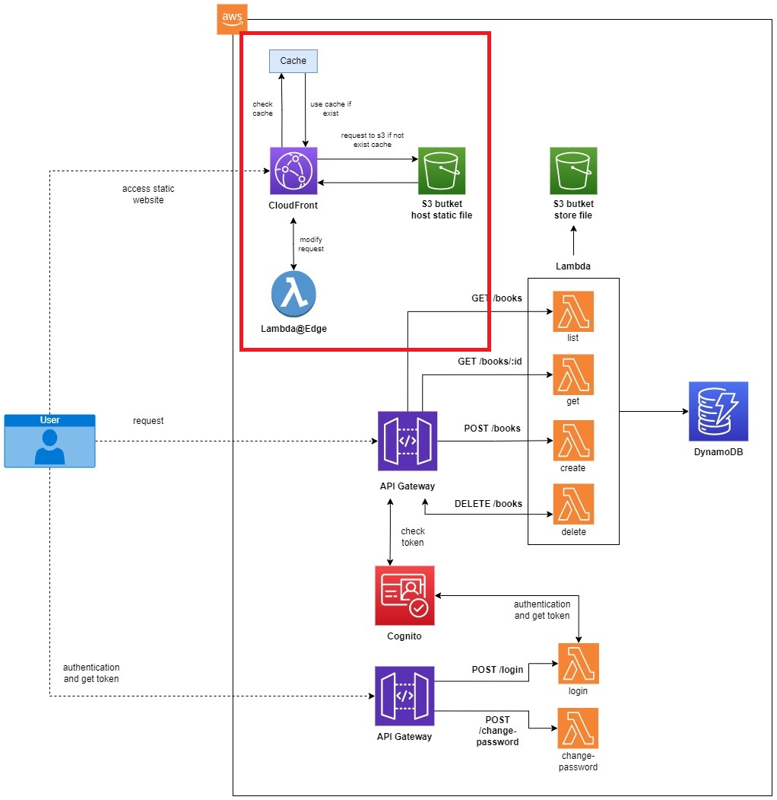

# aws-lambda-apigw-dynamodb-s3-cognito-cfront-cicd-golang 🐳


[](https://github.com/tquangdo/aws-lambda-apigw-dynamodb-s3-cognito-cfront-cicd-golang/issues/new)


## reference
[viblo](https://viblo.asia/p/serverless-series-golang-bai-1-serverless-va-aws-lambda-gAm5y71XZdb)

## before run terraform
> !! ⚠️⚠️WARNING⚠️⚠️ !!
1. replace `us-west-2` to `us-east-1`
2. replace `<AWS_ACCID>`
3. replace bucketname in `terraform-start/policies/lambda_policy.json`

## bai 4

### up src code to lambda
- create `hello-lambda/main.go`
- `hello-lambda$ go mod init list && go get` -> will create `go.mod` & `go.sum`
- create `hello-lambda/build.sh`
- `chmod +x build.sh`
- `hello-lambda$ ./build.sh` -> will create `hello-lambda/list.zip`
### terraform
- edit bucket name in `lambda_policy.json`
```json
"Resource": "arn:aws:s3:::dtq-bucket-golang-up/*"
```
- move `hello-lambda/list.zip` -> `terraform-start/source/list.zip`
- `terraform-start$ terraform init && terraform apply -auto-approve` -> will create AWS lambda & role
```shell
aws lambda invoke --function-name DTQLambdaGoLang response.json
->
{
    "StatusCode": 200,
    "ExecutedVersion": "$LATEST"
}
```
- `terraform destroy -auto-approve` -> need `terraform-start/source/list.zip` must exist!
> !! ⚠️⚠️WARNING⚠️⚠️ !!
- `hello-lambda/main.go` & `hello-lambda/build.sh` need as same as repo src code
- src code in `## reference` is different!!! Ex: `hello-lambda/build.sh`
```shell
go build -o main main.go # different with `GOOS=linux go build -o main main.go`
```

## bai 5

### user pool
- name=`DTQCognitoUsrPoolGoLang`
### terraform
- will output like code in `bai-5/terraform-start/main.tf`
```yml
output "base_url" {
  value = {
    api = aws_api_gateway_deployment.deployment.invoke_url
    web = aws_s3_bucket.dtq-bucket-golang-spa.website_endpoint
  }
}
```
---
```shell
Outputs:
base_url = {
  "api" = "https://1fvtjd5r25.execute-api.us-east-1.amazonaws.com/staging"
  "web" = "dtq-bucket-golang-spa.s3-website-us-east-1.amazonaws.com"
}
```
### apigw secure
- authorizer name=`DTQAPIGWAuthorizerGoLang`
### login
- edit `user pool > Client ID` in `bai-5/code/login/main.go`
```shell
sh build.sh
aws lambda update-function-code --function-name login --zip-file fileb://login.zip
curl -sX POST -d '{"username":"<GMAIL>", "password": "87654321@bB"}' https://41z6leidch.execute-api.us-east-1.amazonaws.com/staging/login # api gw URL will change after rerun terraform!!!
-> output JSON of "AccessToken", "IdToken"...
```

## bai 6

### terraform
- will output like code in `bai-6/terraform-start/main.tf`
```shell
Outputs:
base_url = {
  "api" = "https://oe3pxhe9h5.execute-api.us-east-1.amazonaws.com/staging"
  "web" = "dtq-bucket-golang-spa.s3-website-us-east-1.amazonaws.com"
}
```
- access "web" on browser

### cfront
- create distribution domain name=`https://d2ixlmqfgvzqk3.cloudfront.net`
- access domain name on browser -> will see
- access `https://d2ixlmqfgvzqk3.cloudfront.net/login` & refresh -> will see ERR `AccessDenied`
### lambda@edge
- create function name=`DTQLambdaEdgeGoLang`

## bai 7

### production
- before access `https://mvbqvkm3e4.execute-api.us-east-1.amazonaws.com/production/books` need run this (unless will have ERR)
```shell
aws lambda add-permission --function-name arn:aws:lambda:us-east-1:<AWS_ACCID>:function:books_list:production --source-arn "arn:aws:execute-api:us-east-1:<AWS_ACCID>:mvbqvkm3e4/*/GET/books"  --principal apigateway.amazonaws.com --statement-id 4d89f8ab-35b4-49a6-aced-f2e318e8e10f --action lambda:InvokeFunction
->
{
    "Statement": "{\"Sid\":\"4d89f8ab-35b4-49a6-aced-f2e318e8e10f\",\"Effect\":\"Allow\",\"Principal\":{\"Service\":\"apigateway.amazonaws.com\"},\"Action\":\"lambda:InvokeFunction\",\"Resource\":\"arn:aws:lambda:us-east-1:<AWS_ACCID>:function:books_list:production\",\"Condition\":{\"ArnLike\":{\"AWS:SourceArn\":\"arn:aws:execute-api:us-east-1:<AWS_ACCID>:mvbqvkm3e4/*/GET/books\"}}}"
}
```
